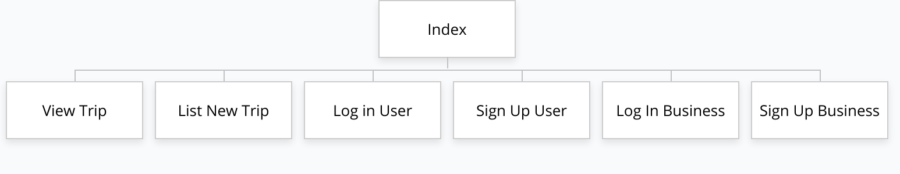
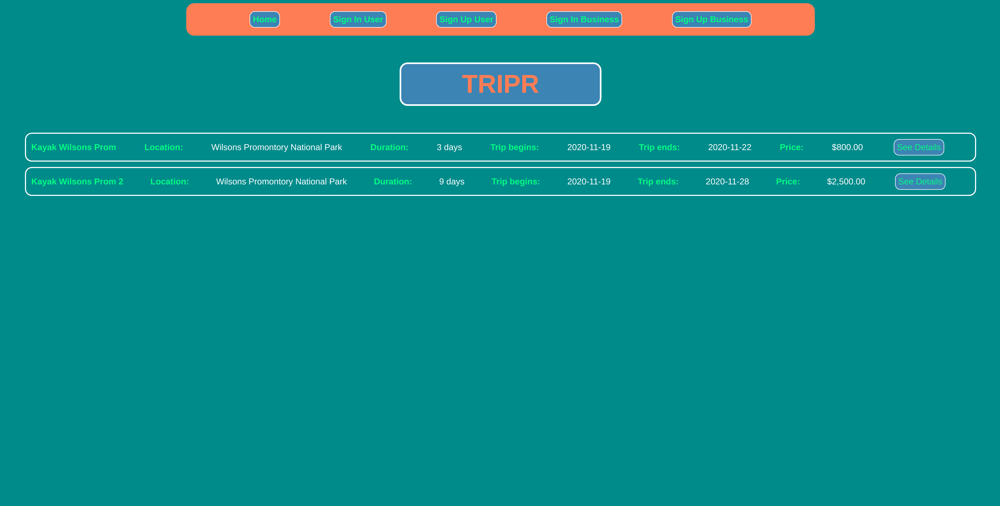
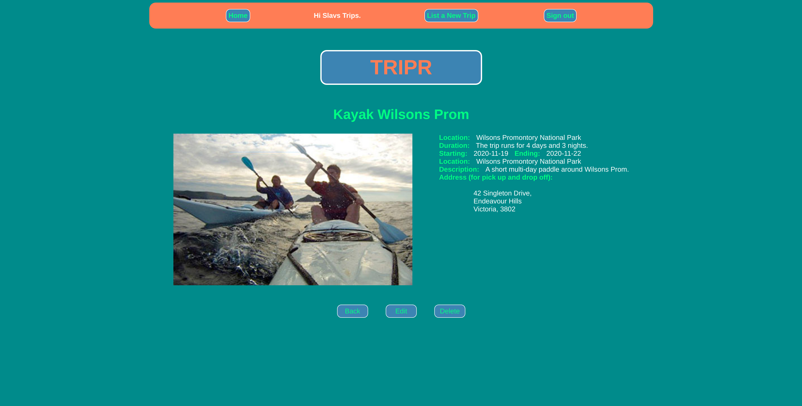
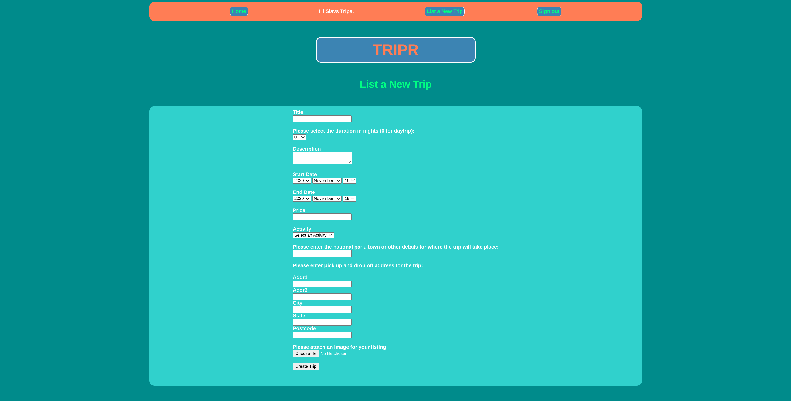
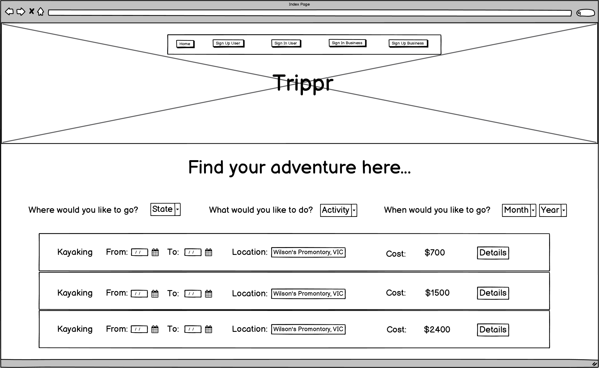
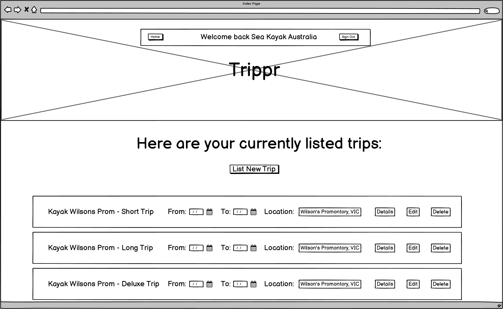
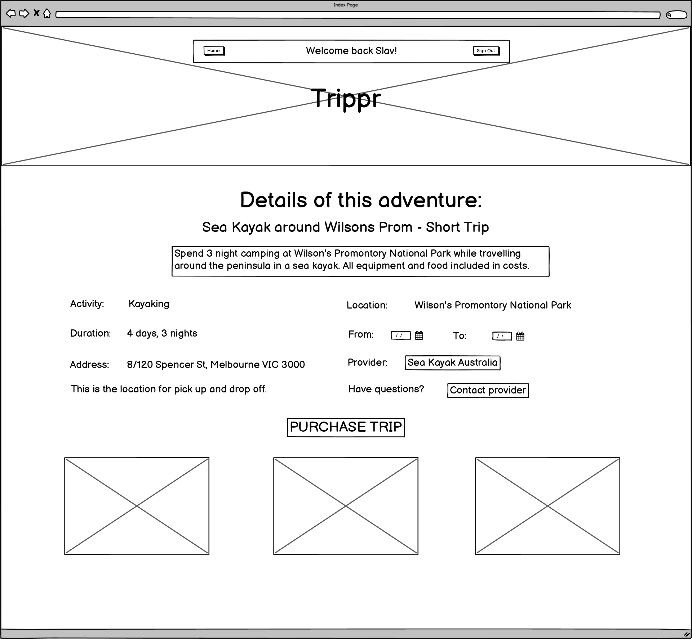
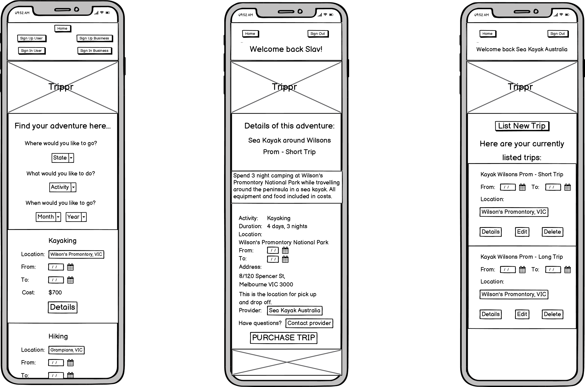
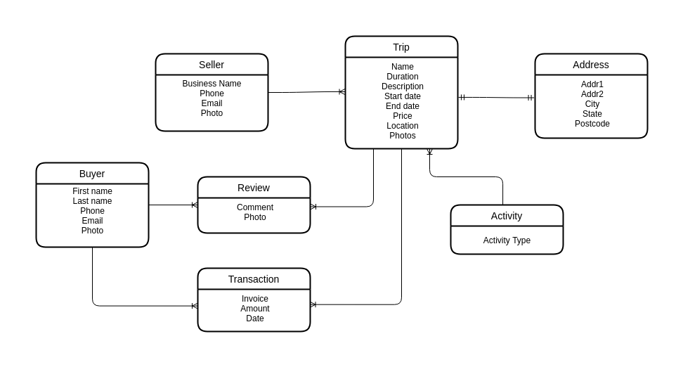
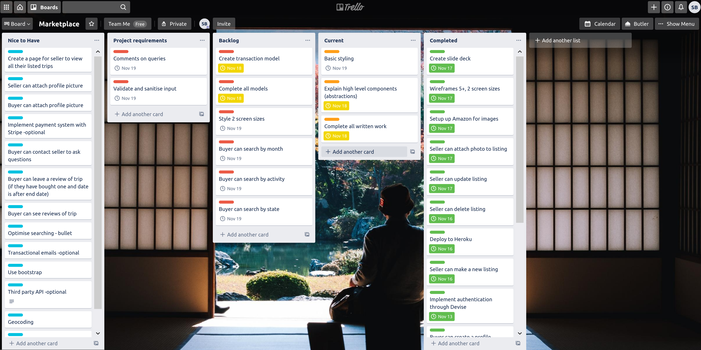

# Tripr
## My Adventure Trip Marketplace App

## Problem

Having done some research on the internet I have found that it can take some effort to find adventure trips along the lines of multi-day hikes, horse treks and sea kayaking expeditions. There are a few small websites showing listings from a handful of providers but generally you would need to go through the websites of individual providers to find what you need. This project is an attempt to create a central website/app where all providers can list their offerings within Australia so that users can go to one location to find their preferred adventure and make it far easier for providers to find customers.

## Link to Deployed App

https://glacial-bayou-90482.herokuapp.com/trips

## Link to Github Repository

https://github.com/SlavBorowski/adventure-trip-app

## Description

The purpose of this marketplace app will be to connect the 2 target audiences, adventure seekers and providers in many outdoor activity fields to make the process easier for both sides, by creating a central point where they can interact. The types of activities currently implemented (which can be expanded) include:
- Hiking
- Kayaking
- Canoeing
- Rock Climbing
- Abseiling
- Horse Riding
- Scuba Diving
- Bike Riding
- Rafting
- Sailing
- Snorkeling
- Surfing

The app has functionality for 2 sets of users implemented through the use of 2 Devise models. The sellers are able to create a profile, then they are able to list numerous trips by filling in a form and attaching images for their listing. They are then also able to edit or delete any listings which belong to them. Sellers are able to create a different type of account, which allows them to view listed trips, with the ability to search by state, activity type and month/year. If they find what they are looking for they can purchase the trip.

## Sitemap

## Screenshots

##  Tech Stack

- HTML & SCSS
- Ruby on Rails
- Devise
- Heroku
- Amazon S3 Storage

## User Stories

- As seller can create a profile
- As seller can attach profile picture
- As seller can make a new listing
- As seller can attach photos to listing
- As seller can delete listing
- As seller can update listing

- As buyer can create profile
- As buyer can attach profile picture
- As buyer can search by state
- As buyer can search by activity
- As buyer can search by date/month
- As buyer can write review for trip/seller
- As a buyer can contact seller to ask questions
- As a buyer I want to see reviews of this trip
- As a buyer I want to leave a review of my trip

## Wireframes

e

## Entity Relationship Diagram

## High Level Components (Abstractions)

Every application created with Ruby on Rails has many abstractions through inheritance. These abstractions are there to hide the complexity of the underlying framework. This allows users to implement an application in a shorter time frame. In my app, the application controller inhertrits from the action controller, then the trips controller inherits from the application controller. In both the application and trips controllers this allows me to do several things. I utilise params which allows me to take input from the browser/user and create records, add data to tables or create users. I make use of redirect_to allowing me to move the user to another view once they have completed a form or clicked a button, and I make use of render to render different views within my app.  

All the models within the application have abstracted methods which they have inherited from active record. I use call .all when I want to create a list of every instance of one model, use .new to create new instances, .save to update a record or .destroy to delete one. All these methods and more are used or available for use without ever seeing or understanding how they were implemented within the framework.

## Third Party Services

I made use of two third part services within my application. The first is Heroku which is a Platform as a Service provider who allow me to make use of Amazon Web Service storage to host my platform without needing to know all of the complex details of using AWS. Making use of the platform is as simple as creating and account and then a bucket to hold my app. After adding my master key from my rails application to Heroku, I can interact with my app/Heroku through the command line. First I used git to push my app to Heroku, then I was able to use the standard rails commands by prepending heroku run.

The second service I utilised was Amazon S3 Storage which allows me to store and files, in this case images uploaded by users of the app, without having to worry about having the inrastructure to do so. The steps here once again involved creating an account and a bucket to hold my files. I then needed to take the keys generated ny Amazon and encrypt them in a credentials file within my app. I also needed to include a gem file and change some config files to point to Amazon's services.

## Database Relations & Models

The database relations to be implemented in the app were based around three key entities, those being sellers, buyers and trips. The seller entity was created to list trips and the buyer to purchase trips . Without these three there would be no application to create. The attributes for the seller and buyer entities are common across most apps that would have a user system in place, similarly, the trip entity has what you would expect for a trip, nothing out of the ordinary.The relationship between seller and trip is one to many as the seller can list many trips but there is no direct relationship between buyer and trip. 

The other entities are: activity, which essentially stores all the activity types that a trip can fall under, having a one activity to many trips relationship; there is an address table which stores all the addresses for the pick up and drop off point for the buyers, which is one to one with trip; a transaction entity which stores an amount and purchase date, and links the buyer and trip, each buyer and trip having a many to one relationship with transaction; finally there is a reviews entity which stores comments and photos from buyers, once again linking buyer and trip on a one to many basis. Foreign keys are stored in the transaction (buyer and trip), review (buyer and trip) and trip (seller, activity and address).

The models created within the application almost exactly reflected what was planned at the beginning of the project. A couple of entities were merged into other entities for the sake of simplifying the app. As for the relationships, they are exactly as was planned.

## Project Management

The tasks for the project were managed through the use of the below Trello board. It incudes 5 columns: Nice to Have - for items that I would like to implement if there is extra time at the end of the project;  Project Requirements - to list any written requirements and non code related items; Backlog - for items yet uncompleted; Current - items currently being workd on; Completed - for completed tasks. 

Through the use of the user stories I generated the coding tasks to list on the board. Items were then arranged by how much of a requirement they were to the basic functioning of the app and placed in the current list, sometimes multiple items if they were related. They were then assigned a deadline based on what I thought was a realistic timeframe to implement that item.

While most items were fairly simple, there was one major roadblock, the implementation of two Devise user models. This took longer to implement than most of the other items and caused some delay in the project.

https://trello.com/b/KG1IbzoN/marketplace

